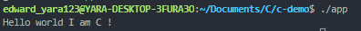

# Say-Hello-In-C
Here in this demo I have created a log file that displays "hello world I am C!" in the terminal

# Demo


# Installation
> sudo apt-get update
> sudo apt install ...

# Languages Used
1. C Programming

# Clone Project
```
  git clone git@github:oluyaratosin123...

```
```C
  cd c-demo
```

# Run the log message
- This is to `printf` "Hello world I am C!" in the console
  - STEP 1
    - `cd c-demo` : This would clone into the demo directory
  - STEP 2
    - `make` : This would generate a `makefile` in the console you should the following
    > gcc -I . -c main.c
    > gcc main.o -o app
  - STEP 3
    - `./app` : This should display `Hello world I am C!` in the console
    > Hello world I am C!

# Author
GitHub: [edward@github.com](https://github.com/oluyaratosin123)
Linkedin: [edward@linkedin.com](https://www.linkedin.com/in/edward-oluyara/)
Twitter: [edward@twitter.com](https://twitter.com/TOluyara)
AngelList: [edward@angelList.com]()
GitLab: [edward@gitLab.com]()

## Contributing :handshake:
Contributions, issues, and feature requests are welcome!

## Show your support
Give a 	:star: if you like this project.

## Acknowledgments
* Hat tip to anyone whose code was used
* Inspiration
* etc
